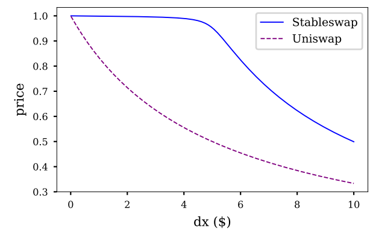

### Background
The Uniswap Model, also referred to as a standard liquidity pool, poses a great disadvantage for stablecoins.
Large trades **relative to the size of the pool** cause higher slippage.
Although not a significant problem for ordinary tokens, high slippage moves the price further along the liquidity curve. 
Since stablecoins are not meant to vary in price, the Uniswap Model clearly is not suited for pegged assets.
For a stablecoin to remain **stable**, it is essential that large trades are executed with minimal slippage to stop any deviations from its peg.

### Introducing vPegSwap

vPegSwap is Value DeFi’s Solidity implementation of [Curve’s highly successful StableSwap](https://curve.fi/files/stableswap-paper.pdf)
vPegSwap has been built for the Binance Smart Chain (BSC) to take advantage of the significantly reduced fees. 
Although appearing to be like a standard AMM, vPegSwap is specially designed for stablecoins with very minimal price slippage.
Liquidity providers may also take advantage of the stablecoin aspect and use vPegSwap as a **fiat savings account**.
Since there is no impermanent loss, supply liquidity can be thought of as depositing savings into a bank. 
Additionally, the returns on vPegSwap are substantially higher than traditional banking, making it highly profitable for users.

### Motivation

Stablecoins have become increasingly popular with more ‘pegged’ tokens being implemented each day.
However, every non-backed stablecoin shares one fundamental flaw — price stability.
To counteract this flaw, we have implemented vPegSwap. With the appearance of a typical AMM exchange, vPegSwap offers extremely low price slippage (typically 100 times smaller). 

_Projects wishing to launch their own stablecoins are welcomed to use vPegSwap pools for their own price stability._ 

### Mechanics

_“Curve’s StableSwap provides a mechanism to create cross-markets for stablecoins in a way which could be called Uniswap with leverage.”_
— [Quoted from Curve’s Stableswap Whitepaper by Michael Egorov. Published November 10, 2019](https://curve.fi/files/stableswap-paper.pdf)
The Curve.fi model uses a more complex algorithm called the **StableSwap invariant** which is optimized for minimal slippage.
Using this algorithm results in a price curve that is flatter around the optimal peg range.
This means that large trades will have a much smaller impact when made around the peg, which is exactly what algo-stables need.

**Example use case: Uniswap invariant (dashed line) vs Stableswap invariant (solid line)**

[Image from Curve: Stableswap Whitepaper](https://curve.fi/files/stableswap-paper.pdf)

This graph represents slippage during swaps that are large enough to move a token’s price.
Notice how the Stableswap invariant remains almost flat, which is much smaller when compared to the Uniswap invariant.
Essentially, slippage when using Stableswap is negligible, while the Uniswap invariant suffers from heavy slippage at the slightest change in price.

### Results
The ultimate result is the ability for a user to send massive trades with minimal losses.
This should be a norm for swapping between stablecoins, but instead on traditional DEX’s, these trades are still punished like swapping between two non-stablecoins.

_Swapping 10k USDC to BUSD with a <$4 loss._

Traders are able to easily move 6, 7 and even 8 figures between BUSD/DAI/USDC/USDT with minimal slippage through the combination of the StableSwap algorithm and deep liquidity in the vPegPools.
Users wishing to just use vPegSwap as a savings account are able to make use of pool incentives and swapping fees. Even though the fees are tiny (approx. 0.04%), they add up when trading over $50m per day. Some pools are offering ‘Infinity APY’ returns where the compounding rewards are too high for the amount of integers we can display. Essentially anything more than 999 million percent per year.
**A massive advantage for projects wishing to use vPegSwap for their stablecoin liquidity pools is the Stableswap invariant curve.**
Since there is almost zero slippage when swapping, if a token is to be rapidly ‘dumped’, vPegSwap’s mechanics would reduce the impact of the dumping on the price. 
**Using vPegSwap will help keep stables ‘on-peg’ or closer to their peg compared to traditional pools.**

### Technical

For a detailed rundown of vPegSwap, please refer to [Curve’s StableSwap Whitepaper](https://curve.fi/files/stableswap-paper.pdf)
The Curve team have gone into incredible depth to explain their calculations and how the Stableswap invariant liquidity curve functions.

