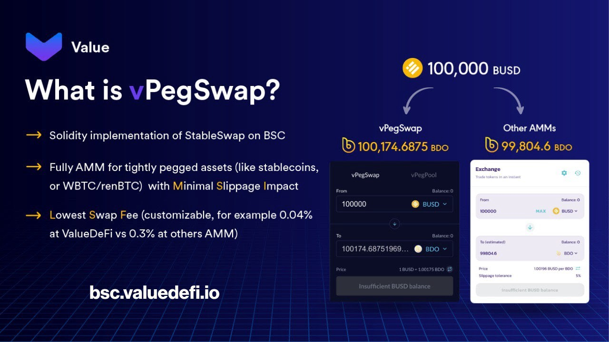

---

### BACKGROUND

The Uniswap Model, also referred to as standard liquidity pool, poses great disadvantages for stablecoins as large trades **relative to the size of the pool** cause higher slippage. This is not a significant problem for ordinary tokens, but high slippage moves the price further along the liquidity curve. 

Since stablecoins are not meant to vary in price, the Uniswap Model clearly is not suited for pegged assets. For a stablecoin to remain **stable**, it is essential that large trades be executed with minimal slippage to stop any deviations from its peg.

### OVERVIEW

vPegSwap is VALUE DeFi’s Solidity implementation of [Curve’s highly successful StableSwap](https://curve.fi/files/stableswap-paper.pdf). vPegSwap has been built for the Binance Smart Chain (BSC) to take advantage of the lower fees and is specially designed for stablecoins with minimal price slippage. (Price slippage on vPegswap is typically 100 times less than that on other AMM exchanges.) Therefore, liquidity providers may also use vPegSwap as a **fiat savings account**, as there is no permanent loss and supplying liquidity can be thought of as depositing savings into a bank. Furthermore, returns on vPegSwap are substantially higher than those in traditional banking, making it highly profitable for users.

_Projects wishing to launch their own stablecoins are welcome to use vPegSwap pools for their own price stability._ 

### MECHANICS

>“Curve’s StableSwap provides a mechanism to create cross-markets for stablecoins in a way which could be called Uniswap with leverage.”

— [from Curve’s Stableswap Whitepaper by Michael Egorov. Published November 10, 2019](https://curve.fi/files/stableswap-paper.pdf)

The Curve.fi model uses a more complex algorithm called the **StableSwap invariant** which is optimized for minimal slippage. Using this algorithm results in a price curve that is flatter around the optimal peg range. This means that large trades will have a much smaller impact when made around the peg, which is exactly what algo-stables need.

**Example use case: Uniswap invariant (dashed line) vs Stableswap invariant (solid line)**

[Image from Curve: Stableswap Whitepaper](https://curve.fi/files/stableswap-paper.pdf)

This graph represents slippage during swaps that are large enough to move a token’s price.
It can be seen that the Stableswap invariant remains almost flat, which is much smaller when compared to the Uniswap invariant. Essentially, slippage when using Stableswap is negligible, while the Uniswap invariant suffers from heavy slippage at the slightest change in price.

### RESULTS
The ultimate result is the ability of a user to send massive trades with minimal losses.
This should be a norm for swapping between stablecoins, but instead on traditional DEX’s, these trades are still punished like swapping between two non-stablecoins.

  
_Swapping 10k USDC to BUSD with a <$4 loss._

vPegSwap allows traders to easily move 6, 7 and even 8 figures between BUSD/DAI/USDC/USDT with minimal slippage through the combination of the StableSwap algorithm and deep liquidity in the vPegPools.
Users who only want to use vPegSwap as a savings account can take advantage of pool incentives and swapping fees. Even though the fees are tiny (approx. 0.04%), they add up when trading over $50m per day. Some pools offer ‘Infinity APY’ returns where the compounding rewards are higher than 999 million percent per year.

A massive advantage for projects wishing to use vPegSwap for their stablecoin liquidity pools is the Stableswap invariant curve. Since there is almost zero slippage when swapping, if a token is to be rapidly ‘dumped’, vPegSwap’s mechanics would reduce the impact of the dumping on the price. **Using vPegSwap will help keep stables ‘on-peg’ or closer to their peg compared to traditional pools.**

### TECHNICALS

For a detailed rundown of vPegSwap, please refer to [Curve’s StableSwap Whitepaper](https://curve.fi/files/stableswap-paper.pdf). The Curve team has gone into incredible depth to explain their calculations and how the Stableswap invariant liquidity curve functions.

### GETTING STARTED
- vPegSwap on BSC: https://bsc.valuedefi.io/#/vpeg-swap
